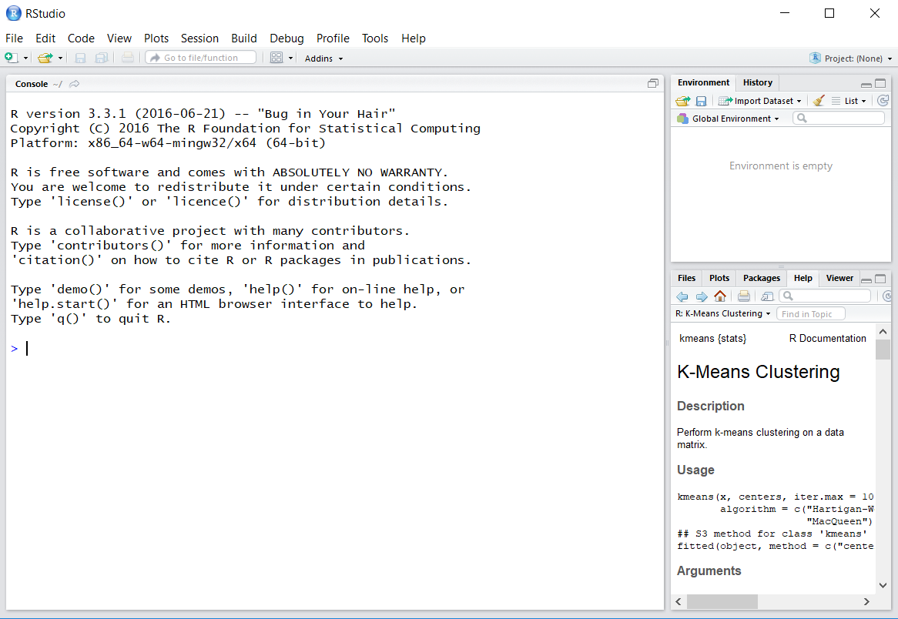

```{r setup, include=FALSE}
knitr::opts_chunk$set(echo = TRUE)
```

## Welcome

This is the preparation and teaching material website for the GLEON 19 Machine Learning
workshop. 

---

## Setting up R

First, we need to setup R and an editor for you. For R there is really no choice. For an R editor
there are many, but the most common to use is RStudio. 

Steps: 

1. [Download the latest version of R if you don't already have it](https://cran.r-project.org/). Install it. 
2. [Download the latest version of RStudio if you don't have it](https://www.rstudio.com/products/rstudio/download/#download).
Install it. 
3. Verify that you can run RStudio. It should look something like the image below. 




## Installing Needed Packages

We will use a wide variety of R packages today during the workshop. They will take a little bit of time 
to download and install, so go ahead and do that whenever you are ready. The core packages we will need 
are `dplyr, ggplot2, rLakeAnalyzer, randomForest, neuralnet, e1071`. The code below will download and 
install all of those core packages. Please copy-paste this code into your R console and run. 

```{r, eval=FALSE, echo=TRUE}

install.packages(c('dplyr', 'ggplot2', 'rLakeAnalyzer', 'randomForest', 'neuralnet', 'e1071', 'caret'))


```


---

## Get the Workshop Example Materials

The workshop example scripts and data have been provided to make it 
easier to follow along with the instructor. [Download the most recent
materials here](https://github.com/lawinslow/machine_learning/archive/master.zip). 
Once downloaded, unzip the contents and put the folder somewhere easily accessible. 


## Workshop Agenda

8:30 - 9:00 Get data and packages loaded

9:00 - 9:30 Opening Remarks and introduction to machine learning

9:30 - 10:30 Main course: Cluster Analysis

10:30 - 10:50 BREAK

10:50 - 11:50 Main course: Support Vector Machines

11:50 - 12:00 Organize breakout groups and break for lunch

12:00 - 13:30 Lunch (Please discuss and brainstorm over lunch)

13:30 - 13:50 Breakout groups with application brainstorming sessions

13:50 - 14:50 Main course: Random Forests

14:50 - 15:00 BREAK

15:00 - 16:00 Main course: Neural Networks

16:00 - 16:30 Breakout groups with application brainstorming sessions with final report back

